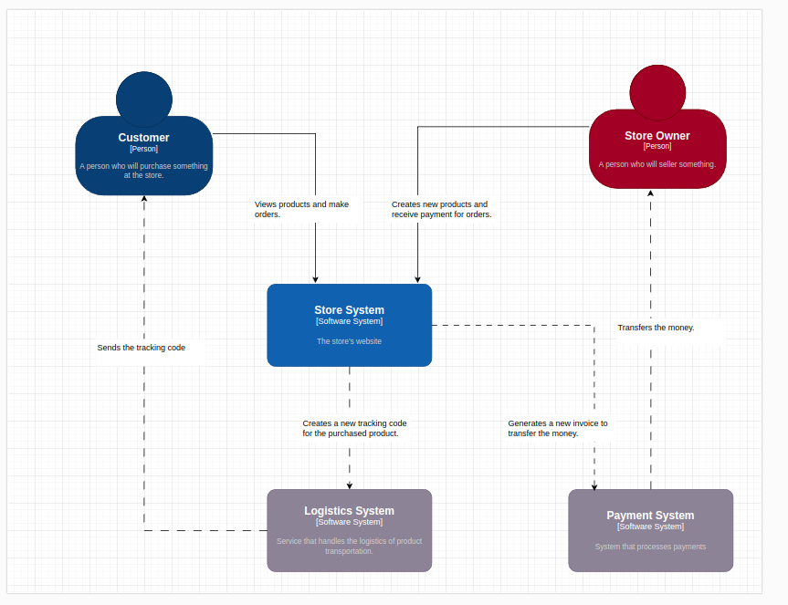
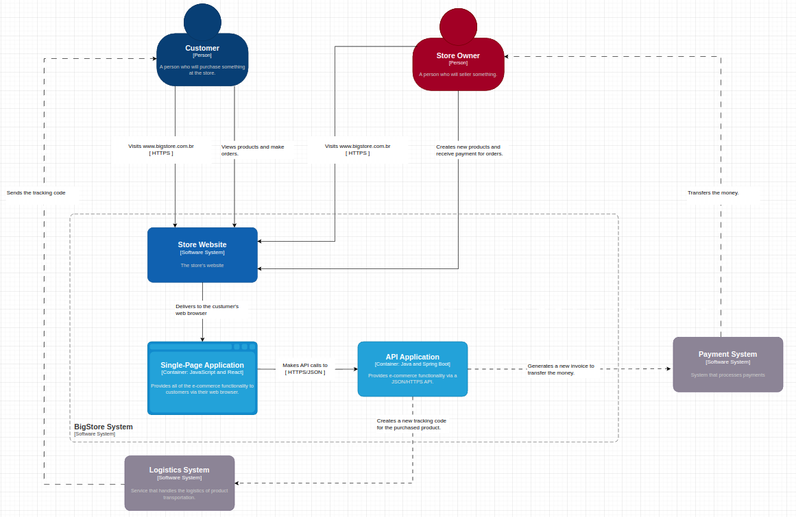
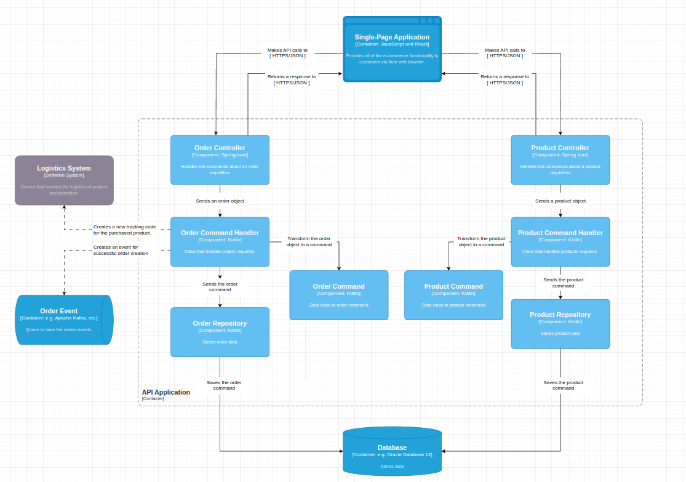

# Temas técnicos desse projeto

- [System design](#architecture)
- [Annotations](#annotations)
- Ports and adapters
- [DDD](#ddd)

## Architecture

### System Design

- Diagrama de contexto: O nível de contexto fornece uma visão geral do sistema, mostrando como ele se relaciona com o ambiente externo, incluindo usuários, sistemas externos e outras entidades com as quais interage.



- Diagrama de containers: Este nível descreve os principais subsistemas ou contêiners que compõem o sistema de software.



- Diagrama de componentes: No nível de componentes, detalha-se o interior de cada contêiner, identificando os principais componentes de software e suas interações.




## Annotations

**Annotations** fazem parte do dia a dia do desenvolvimento de software, isso porque precisamos, muitas vezes,
encapsular dados e reutilizar funcionalidades em boa parte do código. Acontece que nem todo desenvolvedor chegou a fazer
uma annotation do zero. Por mais que ela seja super comum de ser utilizada, a criação do zero é um pouco mais rara de ser
vista dado o fato de que já temos muitas annotations utilitárias nativas ou que vêm em alguma biblioteca externa.

### O que são annotations

Annotations são funções que podem ser usadas em classes, métodos ou atributos.
As annotations têm a seguinte assinatura: **@** seguido do **nome da anotação**.

### Criação de annotations (Kotlin)

Iremos criar uma annotation que mascara dados sensíveis quando o atributo de uma classe conter a annotation nomeada como
**Mask** em cima de sua declaração.

```kotlin
/*
Precisamos importar do kotlin.reflect o atributo declaredMemberProperties e o método findAnnotation que serão
utilizados adiante
*/

import kotlin.reflect.full.declaredMemberProperties
import kotlin.reflect.full.findAnnotation

// Aqui utilizamos uma annotation chamada @Retention com o argumento RUNTIME indicando que rodará em tempo de execução
@Retention(AnnotationRetention.RUNTIME)
// Aqui usamos a estrutura que o Kotlin pede para declarar a annotation e seu nome representativo
annotation class Mask
```

Agora precisamos fazer alguma lógica para que quando alguma propriedade chame essa annotation, ela possa realizar um
comportamento de mascarar dados.

```kotlin
import kotlin.reflect.full.declaredMemberProperties
import kotlin.reflect.full.findAnnotation

@Retention(AnnotationRetention.RUNTIME)
annotation class Mask

/*
Aqui criamos um método que ficará responsável por receber qualquer objeto e nele percorrer suas propriedades para mascarar
quem usar a annotation Mask
*/
fun maskValue(obj: Any) {
    /*  Aqui conseguimos pegar do objeto as propriedades de todos os membros declarados nele.
     Ex de obj::class.declaredMemberProperties: [val domain.client.Client.address: domain.client.Client.Address, val domain.client.Client.cpf: kotlin.String]
    e, se
    */
    obj::class.declaredMemberProperties
        .filter {
            it.findAnnotation<Mask>() != null
        }.associateWith { property ->  property.findAnnotation<Mask>() } /* aqui estamos pegando a propriedade que possuem a annotation Mask em si
         para manipularmos seus valores futuramente */
        // Para conseguirmos tratar cada propriedade individualmente, precisamos percorrer esse array de propriedades.
        .forEach { (property) ->
            // Com a propriedade em nossas mãos, agora conseguimos saber qual campo estamos nesse exato momento do loop
            val field = obj::class.java.getDeclaredField(property.name)

            /* Aqui usaremos uma funcionalidade bastante conhecida no Java que é a reflection, com ela poderemos mudar a acessibilidade
             do campo, fazendo com que possamos modificar seu valor em seguida.
            */
            field.isAccessible = true

            /* Como estamos lidando com uma linguagem tipada, precisamos identificar qual é o tipo do valor do campo atual
             aqui estamos verificando apenas 3 tipos primitivos sendo: String, Double, Int.
             Outro ponto é que existe a possibilidade de não ser um tipo primitivo e sim um objeto, então no else criamos uma recursão para que
             possamos enviar novamente o valor do campo para refazer toda essa etapa de loop nas propriedades desse objeto.
            */

            field.get(obj).let {
                if(it != null) when(field.type) {
                    String::class.java -> field.set(obj, "*".repeat((it as String).length))
                    Int::class.java -> field.set(obj, 0)
                    Double::class.java -> field.set(obj, 0.0)
                    else -> maskValue(it)
                }
            }
        }
}
```

Aqui finalizamos a lógica de mascarar os dados. Agora, iremos criar uma classe que possa usar essa annotation e futuramente
ter seus dados sensíveis mascarados.

```kotlin
import domain.Mask

// Usamos a annotation como: @property:Mask para que possamos identificá-la na lógica anterior do método maskValue

data class Client(
    val name: String,
    @property:Mask
    val cpf: String,
    @property:Mask
    val address: Address
) {
    data class Address(
        @property:Mask
        val street: String,
        @property:Mask
        val number: String?,
        @property:Mask
        val postalCode: String
    )
}
```

Para testarmos isso, podemos criar um mock que nos ajude a validar alguns casos de teste.

```kotlin
import domain.client.Client
import domain.client.Client.Address

// Bloco de objetos mocados
object MaskTestFixture {

    fun client(addressNumber: String? = null) = Client(
        name = "Marlin Stone",
        cpf = "00000000000",
        address = Address(
            street = "Jr.Street",
            number = addressNumber,
            postalCode = "62375000"
        )
    )

    fun clientMasked(
        addressNumber: String? = null
    ) = client(addressNumber).let {
        it.copy(
            cpf = "*".repeat(it.cpf.length),
            address = Address(
                street = "*".repeat(it.address.street.length),
                number = it.address.number?.let {
                        number -> "*".repeat(number.length)
                },
                postalCode = "*".repeat(it.address.postalCode.length)
            )
        )
    }
}
```

```kotlin
import domain.MaskTestFixture.client
import domain.MaskTestFixture.clientMasked
import io.kotest.core.spec.style.DescribeSpec
import io.kotest.matchers.shouldBe

// Validação dos casos de testes
class MaskTest: DescribeSpec({
    describe("Mask Annotation Test") {
        it ("Should mask the client's address") {
            val addressNumber = "123"
            val client = client(addressNumber)

            // Ira mascarar o cpf e todos os campos de address
            maskValue(client)

            client shouldBe clientMasked(addressNumber)
        }

        it ("Should not mask a null value") {
            val client = client()

            maskValue(client)

            client.address.number shouldBe null
        }
    }
})
```

## DDD

Antes de implementarmos o DDD no nosso projeto, precisamos adaptá-lo para lidar com esse design. Primeiramente, precisamos entender que estamos trabalhando com o kotlin juntamente com gradle. Para isso, precisamos usá-lo a nosso favor.

- Configurando o build.gradle global do projeto:

**Aqui iremos organizar nosso build gradle para instalar dependências que são compartilhadas por cada módulo.**

```kts
// Declamos os plugins necessários para rodar a aplicação
plugins {
    kotlin("jvm") version "1.9.0"
    application
}

// Criamos atribuímos valors para varíaveis que identificam o projeto
group = "com.ecommerce"
version = "1.0-SNAPSHOT"

// Aqui criamos as variáveis que contém uma string com o valor da versão da dependência
val kotestVersion = "5.8.0"

// Dizemos o lugar que baixará as dependências
repositories {
    mavenCentral()
}

/*
Esta extensão de propriedade adiciona uma propriedade fullName a um objeto Project no Gradle. 
O método get() é implementado para retornar o nome completo do projeto, incluindo os nomes de todos os seus pais (se houver) separados por hifens.

Se o projeto tiver um pai, ele concatena o nome completo do pai com um hífen e o nome do próprio projeto.
Se não houver um pai, ele simplesmente retorna o nome do projeto.
*/
val Project.fullName: String get() = (parent?.fullName?.plus("-") ?: "") + name

// Configurações dos subprojetos que irão conter essas mesmas dependências em comum 
subprojects {
    /*
    Essa verificação é porque os blocos de configuração dentro dele serão aplicados apenas se os diretórios src/main/kotlin ou src/main/resources existirem. 
    Isso significa que as configurações específicas do Kotlin, como a aplicação do plugin org.jetbrains.kotlin.jvm,
     definição de dependências e configurações de tarefas de teste, só serão aplicadas se o projeto contiver a estrutura esperada de um módulo em kotlin.
    Isso é uma prática comum em scripts de construção para garantir que as configurações sejam aplicadas apenas quando 
    necessário, evitando a aplicação desnecessária de plugins ou dependências em projetos que não os utilizam.
     */
    if (file("src/main/kotlin").isDirectory || file("src/main/resources").isDirectory) {
        apply {
            plugin("org.jetbrains.kotlin.jvm")
        }

        dependencies {
            testImplementation("io.kotest:kotest-runner-junit5:$kotestVersion")
            testImplementation("io.kotest:kotest-assertions-core:$kotestVersion")
            implementation("org.jetbrains.kotlin:kotlin-reflect:1.6.10")
        }
        
        // Aqui configuramos a task de teste
        tasks.withType<Test>().configureEach {
            useJUnitPlatform()
        }

        // Indicamos que o compilador Kotlin deve ser configurado para usar a versão 8 do JDK, que corresponde ao Java 8.
        kotlin {
            jvmToolchain(8)
        }
    }
}
```

- Configuração do settings.gradle.kts:

**Depois de configurar o build.gradle, precisamos indicar no settings.gradle.kts que usaremos uma estrutura com módulos separados. Para isso, precisamos incluir cada módulo dentro de um bloco include() para ele entender aquela pasta como um módulo com dependências próprias e lógicas específicas.**

**OBS: Antes de modificar o settings.gradle.kts crie as seguintes pastas:**

- ecommerce-core = Na raiz do projeto
  - domain = Dentro de ecommerce-core
  - application = Dentro de ecommerce-core
  - adapters = Dentro de ecommerce-core

**Em breve teremos mais módulos dentro de adapters e mais a frente lembrarei a você de configurar dentro do include esses novos módulos.**

```kts
rootProject.name = "e-commerce"

/*
Ao habilitar o recurso de "Acesso Typesafe ao Projeto", os scripts de construção do Gradle podem acessar propriedades e 
métodos de objetos do projeto de uma maneira que é mais segura em relação aos tipos de dados. Isso ajuda a reduzir a p
possibilidade de erros devido a referências incorretas ou acesos inválidos aos objetos do projeto.
 */
enableFeaturePreview("TYPESAFE_PROJECT_ACCESSORS")

// Você precisa adicionar o nome da pasta e se houver submódulos dentro de outros módulos, precisará indicar aqui separando-as com : (dois pontos).
include(
    "ecommerce-core",
    "ecommerce-core:domain",
    "ecommerce-core:application",
    "ecommerce-core:adapters"
)

/* O bloco pluginManagement é usado para gerenciar
a resolução de plugins do Gradle. Ele permite configurar os repositórios onde 
o Gradle procura por plugins e define as versões dos plugins a serem usadas em todo o projeto.
*/
pluginManagement {
    repositories {
        mavenCentral()
        gradlePluginPortal()
    }
}
/* O bloco dependencyResolutionManagement é usado para gerenciar a resolução de dependências do Gradl
e. Ele permite configurar os repositórios onde o Gradle procura por dependências e define as versões das
dependências a serem usadas em todo o projeto.
 */
dependencyResolutionManagement {
    repositories {
        mavenCentral()
    }
}
```

Agora você já tem tudo organizado para poder iniciar com cada camada(adapters, application, domain) com responsabilidades
próprias e que não interferem uma nada outra, caso você precisa de uma das camadas incluída em outra, usará a técnica de
adicioná-la como uma dependência. Veremos isso em seguida.